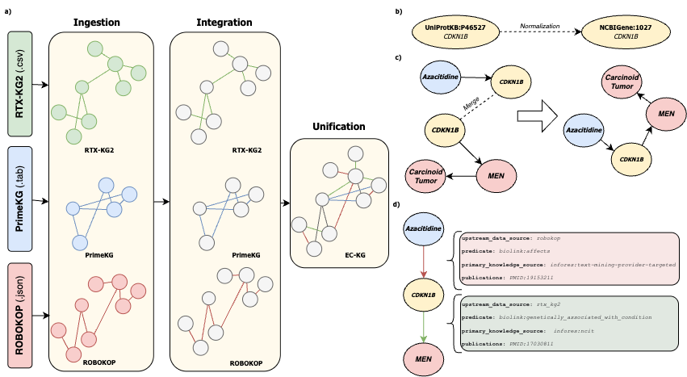

# EC-KG: Every Cure Knowledge Graph, a Unified Biomedical Knowledge Graph for Drug Repurposing

This repository contains complementary analysis code to the Every Cure KG publication. 

DOI to the datasets published: doi.org/10.5281/zenodo.20815441

Paper: to be added




## EC-KG Usage 

If you are interested in using EC-KG, please see our [hugging face org](https://huggingface.co/datasets/everycure) - this is where you can find information on EC-KG [nodes](https://huggingface.co/datasets/everycure/kg-nodes), [edges](https://huggingface.co/datasets/everycure/kg-edges) as well as supplementary [drug list](https://huggingface.co/datasets/everycure/drug-list), [disease list](https://huggingface.co/datasets/everycure/disease-list) and [indications list](https://huggingface.co/datasets/everycure/indications-list). 

You can load EC-KG nodes and edges with a few lines of code with help of HF Datasets library:
```
from datasets import load_dataset

edges_ds = load_dataset("everycure/kg-edges")
nodes_ds = load_dataset("everycure/kg-nodes")
```
## EC-KG re-construction
If you want to reproduce EC-KG construction, see code constructing EC-KG, see [MATRIX repo](https://github.com/everycure-org/matrix). MATRIX pipeline can be used out of the box to re-construct KG by running a series of `make` commands:
```bash
uv venv
uv sync
make local_test # to see if pipeline works as expected
kedro run --pipeline data_engineering # to reconstruct
```
Detailed documentation how to use MATRIX pipeline can be found at https://docs.dev.everycure.org/getting_started/


## Technical Validation
Below code (wrapped in Makefile for ease of use) can be used to reproduce the analysis used in the technical validation section of the paper. Note that the computations performed are computationally intensive and require at least 32 GB of RAM, with 4-hop SOP calculation requiring up to 512 GB for extracting paths from EC-KG.

### Emergence of Novel Context
To reproduce the analysis for Emergence of Novel Context section, run:
```
make emergence_novel_context
```

### Knowledge Source Aggregation
To reproduce Knowledge Source Aggregation Analysis, run:
```
make knowledge_source_aggregation
```

### Machine Learning Validation
To reproduce the ML-based validation of computational drug repurposing use case, one needs to reproduce the KG re-construction and modelling run using [MATRIX modelling pipeline](https://github.com/everycure-org/matrix/tree/feat/kg-manuscript-model-run). 
0. Re-construct EC-KG using MATRIX pipeline using git sha `60369715eff704384189ce11a22c4a0cbc0b9f24`. This step is essential to ensure all datasets are aligned with the kedro data catalog, enabling MATRIX modelling pipeline running out of the box.
```bash
git checkout 60369715eff704384189ce11a22c4a0cbc0b9f24
kedro run --pipeline data_engineering 
``` 
1. Using [MATRIX pipeline](https://github.com/everycure-org/matrix), run `feature_modelling` pipeline for RTX-KG2 using git sha `5654eec23ca9662e168432614a7b40499a3cfb9f`:
```bash
git checkout 5654eec23ca9662e168432614a7b40499a3cfb9f
kedro run --pipeline feature_and_modelling
```
2. Using [MATRIX pipeline](https://github.com/everycure-org/matrix), run `feature_modelling` pipeline for PrimeKG using git sha `2d93853a2703b33c75ca535a8ec2c60407ce56e0`:
```bash
git checkout 2d93853a2703b33c75ca535a8ec2c60407ce56e0
kedro run --pipeline feature_and_modelling
```
3. Using [MATRIX pipeline](https://github.com/everycure-org/matrix), run `feature_modelling` pipeline for ROBOKOP using git sha `88d1c75ef534a02b2ac1ee3a808c057de601f8d9` 
```bash
git checkout 88d1c75ef534a02b2ac1ee3a808c057de601f8d9
kedro run --pipeline feature_and_modelling
```
4. Using [MATRIX pipeline](https://github.com/everycure-org/matrix), run `feature_modelling` pipeline for EC-KG using git sha `58ff055483c1fe1fb6f3ee57379729e4ac753e4d`
```bash
git checkout 58ff055483c1fe1fb6f3ee57379729e4ac753e4d
kedro run --pipeline feature_and_modelling
```

Figure 8a code and its committed compact evaluation outcomes live in [`technical_validation/ml_validation/figure_8_ml_validation/`](technical_validation/ml_validation/figure_8_ml_validation/). Reproduce the disease-bootstrap F1 analysis and PDF without GCS access:

```bash
make figure_8a
```

To regenerate the compact outcomes from the full downloaded model matrices, use:

```bash
MATRIX_ROOT=/path/to/downloaded/figure-8-matrices make figure_8_extract figure_8a
```

See that directory's README for the exact model-run provenance and statistical plan.

## Figure Generation
Scripts for the paper's figures. All outputs are PDF, produced with matplotlib.

| Directory | Script | Output |
|---|---|---|
| `sankey/` | `sankey.py` | `sankey.pdf` — full EC-KG edge-flow diagram |
| `distribution/` | `distribution.py` | `distribution_nodes.pdf`, `distribution_edges.pdf` |
| `distribution/` | `upstream_distribution.py` | `upstream_nodes.pdf`, `upstream_edges.pdf`, `upstream_pks.pdf` — grouped bar charts |
| `distribution/` | `upstream_stacked_bar.py` | `upstream_stacked_bar.pdf` — 3-panel version of the above; one stacked bar per item (top 15), segmented by each upstream source's contribution |
| `distribution/` | `predicate_distribution.py` | `predicate_distribution.pdf` — biolink hierarchy tree |
| `CoreEntities_sankey/` | `drug_sankey.py` | `drug_sankey_full.pdf`, `drug_sankey_grouped.pdf` |
| `CoreEntities_sankey/` | `disease_sankey.py` | `disease_sankey_full.pdf`, `disease_sankey_grouped.pdf` |
| `UpstreamData_Venn/` | `upstream_venn.py` | `upstream_venn_nodes.pdf`, `upstream_venn_pks.pdf`, `upstream_venn_node_ids.pdf`, `upstream_venn_edge_triples.pdf` |
| `UpstreamData_Venn/` | `upstream_upset.py` | `upstream_upset.pdf` — UpSet-style replacement for the node ID, edge triple, and PKS Venn diagrams above (3 panels, bar + membership matrix) |

Shared color constants live in `eckg/colors.py`, shared matplotlib styling in `eckg/style.py`, and shared category-grouping logic in `eckg/grouping.py`; all figure scripts import from these instead of redefining them locally.

The `eckg` package needs to be installed (editable) for these imports to resolve:
```bash
pip install -e .
gcloud auth application-default login
```
All data is read from `mtrx-hub-dev-3of.release_v0_15_19` on BigQuery; results are cached to local CSV/JSON files after the first query, so delete a cache file to force a re-query.

Final publication figures are assembled and polished in Adobe Illustrator from these PDF outputs.